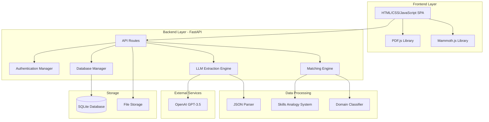
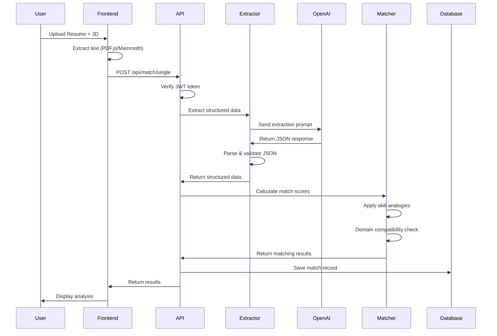

# Resume-JD Matcher: Comprehensive Project Analysis

## 📋 Executive Summary

**Resume-JD Matcher** is a sophisticated AI-powered resume screening platform that automates candidate evaluation through intelligent matching algorithms. The system combines LLM-based data extraction (OpenAI GPT-3.5), multi-criteria scoring, domain classification, and extensive skill analogy mapping to provide accurate, explainable matching results.

**Project Type:** Full-stack web application  
**Tech Stack:** FastAPI (Python) + Vanilla JavaScript frontend  
**AI Integration:** OpenAI GPT-3.5-turbo for structured data extraction  
**Database:** SQLite with comprehensive analytics  
**Deployment:** Self-hosted, no external dependencies beyond OpenAI API

---

## 🏗️ Architecture Overview

### System Architecture



### Data Flow Pipeline



---

## 🔍 Core Components Analysis

### 1. Backend - FastAPI Application ([main.py](file:///m:/llm-Matching/main.py))

**Purpose:** Central API server handling authentication, routing, and orchestration

**Key Features:**
- **Authentication System** - JWT-based with SHA256 password hashing
- **CORS Middleware** - Configured for cross-origin requests
- **File Upload Handling** - Multipart form data for batch processing
- **Error Handling** - Comprehensive exception management
- **Static File Serving** - Serves frontend application

**API Endpoints:**
| Endpoint | Method | Purpose |
|----------|--------|---------|
| `/api/auth/register` | POST | User registration |
| `/api/auth/login` | POST | User authentication |
| `/api/auth/verify` | GET | Token validation |
| `/api/match/single` | POST | Single resume matching |
| `/api/match/batch` | POST | Batch resume processing |
| `/api/dashboard/stats` | GET | Analytics dashboard |
| `/api/dashboard/history` | GET | Match history |
| `/api/health` | GET | Health check |

**Authentication Flow:**
```python
# JWT token creation with SECRET_KEY
token = jwt.encode({
    "email": email,
    "exp": datetime.utcnow() + timedelta(hours=24)
}, SECRET_KEY, algorithm="HS256")
```

**Strengths:**
- ✅ Clean separation of concerns (auth, matching, database)
- ✅ Comprehensive error handling
- ✅ Secure password hashing
- ✅ Token-based stateless authentication

**Areas for Improvement:**
- ⚠️ SECRET_KEY stored in environment (good) but fallback to hardcoded value (security risk)
- ⚠️ No rate limiting on API endpoints
- ⚠️ No request validation middleware
- ⚠️ File uploads stored locally without cleanup mechanism

---

### 2. LLM Extraction Engine ([llm_extraction.py](file:///m:/llm-Matching/llm_extraction.py))

**Purpose:** Extract structured data from unstructured resume/JD text using OpenAI GPT

**Key Features:**
- **Multi-format Support** - PDF (pdfplumber), DOCX (python-docx), TXT
- **Prompt Engineering** - Carefully crafted extraction prompts
- **Response Caching** - In-memory cache to reduce API calls
- **Retry Logic** - 3 retries with exponential backoff
- **JSON Validation** - Validates response structure

**Extraction Prompt Structure:**
```
TASK: Extract EXACTLY this JSON from resume. Return ONLY the JSON object.

RESUME:
{content}

REQUIRED JSON:
{
  "role": "current/most recent job title",
  "totalYearsExperience": <number>,
  "experienceDetails": [...],
  "skills": [...],
  "education": [...],
  "domain": "primary industry"
}

CRITICAL RULES:
1. Return ONLY valid JSON
2. No markdown, no explanations
3. All fields must be present
```

**Strengths:**
- ✅ Robust file parsing with multiple libraries
- ✅ Clear, structured prompts
- ✅ Caching reduces API costs
- ✅ Retry mechanism for reliability
- ✅ Validation function ensures quality

**Areas for Improvement:**
- ⚠️ OpenAI API key exposed in `.env` file (should use secrets manager in production)
- ⚠️ No fallback to local LLM if OpenAI fails
- ⚠️ Cache is in-memory only (lost on restart)
- ⚠️ No monitoring of API usage/costs
- ⚠️ Hardcoded model name (`gpt-3.5-turbo`)

---

### 3. JSON Parser ([json_parser.py](file:///m:/llm-Matching/json_parser.py))

**Purpose:** Ultra-robust JSON parsing to handle malformed LLM responses

**Key Features:**
- **Truncation Handling** - Auto-completes incomplete JSON
- **Multi-pass Repair** - Fixes common JSON errors
- **Aggressive Recovery** - Last-resort recovery for severely malformed JSON
- **Type Validation** - Ensures correct data types
- **Default Structures** - Fallback to default values

**Recovery Strategies:**
1. **Extract JSON String** - Finds JSON between `{` and `}` markers
2. **Auto-complete** - Closes unclosed brackets/braces
3. **Fix Common Issues** - Removes trailing commas, fixes quotes
4. **Aggressive Recovery** - Finds last complete structure
5. **Type Validation** - Converts strings to numbers where needed

**Example Recovery:**
```python
# Input: Truncated JSON
{
  "role": "Software Engineer",
  "totalYearsExperience": 5,
  "skills": ["Python", "Java"

# Output: Auto-completed
{
  "role": "Software Engineer",
  "totalYearsExperience": 5,
  "skills": ["Python", "Java"]
}
```

**Strengths:**
- ✅ Extremely robust - handles edge cases well
- ✅ Multiple recovery strategies
- ✅ Detailed logging for debugging
- ✅ Graceful degradation to defaults

**Areas for Improvement:**
- ⚠️ Complex logic could be simplified
- ⚠️ No unit tests visible for edge cases
- ⚠️ Could benefit from schema validation library (e.g., Pydantic)

---

### 4. Matching Engine ([matching_engine.py](file:///m:/llm-Matching/matching_engine.py))

**Purpose:** Core matching algorithm with multi-criteria scoring

**Matching Criteria:**

#### Experience Match (35 points max)
```python
if candidate_years >= required_years:
    score = 35  # Full score
else:
    score = (candidate_years / required_years) * 35
    percentage = (candidate_years / required_years) * 100
```

#### Education Match (25 points max)
```python
EDUCATION_HIERARCHY = {
    "phd": 4, "doctorate": 4,
    "master": 3, "m.tech": 3, "mba": 3,
    "bachelor": 2, "b.tech": 2, "b.s": 2,
    "diploma": 1,
    "high school": 0
}

if candidate_level >= required_level:
    score = 25  # Full score
else:
    score = (candidate_level / required_level) * 25
```

#### Skills Match (40 points max)
**4-Level Matching Strategy:**
1. **Exact Match** - Identical skill names
2. **Analogy Mapping** - Same skill family (React ↔ ReactJS)
3. **Fuzzy Matching** - String similarity ≥70%
4. **Substring Match** - Partial keyword matching

```python
matched_count = len(matched_skills)
required_count = len(required_skills)
percentage = (matched_count / required_count) * 100

if percentage >= 50:
    score = (percentage / 100) * 40
```

**Overall Score Calculation:**
```python
overall_score = (exp_score * 0.35) + (edu_score * 0.25) + (skills_score * 0.40)
# Domain adjustment applied
final_score = overall_score * domain_adjustment_factor
```

**Assessment Levels:**
- 90-100: 🌟 Excellent Match
- 75-89: ✅ Great Match
- 60-74: 👍 Good Match
- 40-59: ⚠️ Moderate Match
- 0-39: ❌ Poor Match

**Strengths:**
- ✅ Well-balanced weighting system
- ✅ Proportional scoring (not binary)
- ✅ Handles edge cases (0 experience, overqualified)
- ✅ Transparent scoring rationale
- ✅ Domain compatibility integration

**Areas for Improvement:**
- ⚠️ Hardcoded weights (should be configurable per organization)
- ⚠️ No machine learning component for adaptive weighting
- ⚠️ Could add more criteria (certifications, projects, years at company)

---

### 5. Skills Analogy System ([skills_analogy.py](file:///m:/llm-Matching/skills_analogy.py))

**Purpose:** Map similar skills across naming conventions and technologies

**Coverage:**
- **500+ Skills** across 12 technology families
- **12 Categories:** Frontend, Backend, Cloud/DevOps, Data/ML, Testing, HR, Sales, Marketing, Finance, Project Management, Manufacturing, Healthcare, Education, Customer Service

**Example Mappings:**
```python
WEB_FRONTEND = {
    "react": ["reactjs", "react.js", "jsx", "react native"],
    "vue": ["vuejs", "vue.js", "vue3"],
    "angular": ["angularjs", "ng", "angular2+"]
}

BACKEND = {
    "nodejs": ["node.js", "node", "javascript", "js"],
    "django": ["python", "drf", "django rest framework"],
    "spring": ["springboot", "java", "spring boot"]
}

CLOUD_DEVOPS = {
    "aws": ["amazon", "amazon web services", "ec2", "s3", "lambda"],
    "kubernetes": ["k8s", "k8", "container orchestration"],
    "docker": ["containerization", "containers"]
}
```

**Skill Matching Logic:**
```python
def find_skill_match(candidate_skill, required_skill):
    # 1. Exact match
    if cand_norm == req_norm:
        return ("exact", 1.0)
    
    # 2. Analogy mapping
    cand_group = get_skill_group(candidate_skill)
    req_group = get_skill_group(required_skill)
    if cand_group and req_group and cand_group == req_group:
        return ("analogy", 0.95)
    
    # 3. Fuzzy matching
    similarity = SequenceMatcher(None, cand_norm, req_norm).ratio()
    if similarity >= 0.70:
        return ("fuzzy", similarity)
    
    # 4. Substring match
    if req_norm in cand_norm or cand_norm in req_norm:
        return ("substring", 0.80)
    
    return (None, 0.0)
```

**Strengths:**
- ✅ Comprehensive coverage across industries
- ✅ Handles common skill variations
- ✅ Extensible design (easy to add new skills)
- ✅ Multi-level matching strategy

**Areas for Improvement:**
- ⚠️ Hardcoded mappings (could use external database)
- ⚠️ No version-specific matching (Python 2 vs Python 3)
- ⚠️ Could benefit from skill taxonomy/hierarchy
- ⚠️ No proficiency level matching (beginner vs expert)

---

### 6. Domain Classification ([domain_classification.py](file:///m:/llm-Matching/domain_classification.py))

**Purpose:** Classify resumes/JDs into industry domains and calculate cross-domain compatibility

**11 Industry Domains:**
1. IT/Software
2. Backend Development
3. Frontend Development
4. AI/ML/Data Science
5. DevOps/Cloud
6. QA/Testing
7. Finance/Accounting
8. Healthcare
9. Sales/Marketing
10. HR/Recruitment
11. Finance/Banking

**Domain Compatibility Matrix:**
```python
DOMAIN_COMPATIBILITY_MATRIX = {
    "IT/Software": {
        "IT/Software": 100,
        "Backend Development": 95,
        "AI/ML/Data Science": 75,
        "Finance/Accounting": 20,  # Low compatibility
        "Healthcare": 15
    },
    "Finance/Accounting": {
        "Finance/Banking": 95,
        "IT/Software": 20,
        "Healthcare": 30
    }
}
```

**Domain Adjustment Factor:**
```python
def calculate_domain_adjustment_factor(compatibility_score):
    if compatibility_score >= 90:
        return 1.0  # No penalty
    elif compatibility_score >= 70:
        return 0.85  # 15% penalty
    elif compatibility_score >= 50:
        return 0.65  # 35% penalty
    elif compatibility_score >= 30:
        return 0.40  # 60% penalty
    else:
        return 0.25  # 75% penalty (major career shift)
```

**Example Impact:**
```
Finance Manager (10 yrs) → AI/ML Engineer role
- Raw score: 65 points
- Domain compatibility: 20% (major shift)
- Adjustment factor: 0.25
- Final score: 65 × 0.25 = 16 points ⚠️
```

**Strengths:**
- ✅ Prevents cross-domain false matches
- ✅ Transparent penalty system
- ✅ Comprehensive compatibility matrix
- ✅ Keyword-based detection with LLM fallback

**Areas for Improvement:**
- ⚠️ Compatibility scores are subjective (could be data-driven)
- ⚠️ No consideration for transferable skills
- ⚠️ Binary domain assignment (no multi-domain profiles)
- ⚠️ Could add sub-domains for finer granularity

---

### 7. Database Manager ([database.py](file:///m:/llm-Matching/database.py))

**Purpose:** SQLite database operations for persistence and analytics

**Database Schema:**

```sql
-- Single matches
CREATE TABLE single_matches (
    id INTEGER PRIMARY KEY,
    user_email TEXT,
    resume_name TEXT,
    job_title TEXT,
    overall_score INTEGER,
    assessment TEXT,
    resume_data TEXT,  -- JSON
    jd_data TEXT,      -- JSON
    matching_result TEXT,  -- JSON
    created_at TIMESTAMP
)

-- Batch results
CREATE TABLE batch_results (
    id INTEGER PRIMARY KEY,
    user_email TEXT,
    batch_id TEXT UNIQUE,
    job_title TEXT,
    total_candidates INTEGER,
    avg_score REAL,
    jd_data TEXT,  -- JSON
    created_at TIMESTAMP
)

-- Batch candidates
CREATE TABLE batch_candidates (
    id INTEGER PRIMARY KEY,
    batch_id TEXT,
    rank INTEGER,
    resume_name TEXT,
    overall_score INTEGER,
    assessment TEXT,
    resume_data TEXT,  -- JSON
    matching_result TEXT,  -- JSON
    created_at TIMESTAMP
)

-- Analytics
CREATE TABLE analytics (
    id INTEGER PRIMARY KEY,
    match_type TEXT,
    total_matches INTEGER,
    avg_score REAL,
    highest_score INTEGER,
    lowest_score INTEGER,
    updated_at TIMESTAMP
)
```

**Key Features:**
- **CRUD Operations** - Create, read, update, delete for all entities
- **Analytics** - Dashboard statistics and trends
- **Export** - Pandas DataFrame integration for CSV export
- **Backup** - Database backup functionality
- **Cleanup** - Remove old data (90+ days)

**Strengths:**
- ✅ Comprehensive schema design
- ✅ JSON storage for flexible data
- ✅ Analytics support
- ✅ Export functionality
- ✅ Backup mechanism

**Areas for Improvement:**
- ⚠️ SQLite not suitable for high concurrency
- ⚠️ No database migrations system
- ⚠️ JSON storage inefficient for querying
- ⚠️ No indexing strategy visible
- ⚠️ Could benefit from ORM (SQLAlchemy)

---

### 8. Frontend Application ([static/index.html](file:///m:/llm-Matching/static/index.html))

**Purpose:** Single-page application for user interaction

**Technology Stack:**
- **HTML5** - Semantic markup
- **CSS3** - Custom styling with CSS variables
- **Vanilla JavaScript** - No framework dependencies
- **PDF.js** - Client-side PDF parsing
- **Mammoth.js** - DOCX file parsing

**Key Features:**
- **Authentication UI** - Login/register forms
- **File Upload** - Drag-and-drop support
- **Text Input** - Paste resume/JD text
- **Batch Processing** - Multiple file upload
- **Results Display** - Tabbed interface (Results + Data)
- **Weight Customization** - Adjustable criteria weights
- **Export** - CSV download for batch results

**UI Components:**
```javascript
// Weight customization sidebar
const DEFAULT_WEIGHTS = {
    experience: 35,
    education: 25,
    skills: 40
};

// Real-time weight adjustment
function syncWeightDisplay(type, weight) {
    currentWeights[type] = weight;
    updateSliderConstraints(type);
    updateTotalWeight();  // Must sum to 100
}

// File extraction
async function extractTextFromPDF(file) {
    const pdf = await pdfjsLib.getDocument(file.arrayBuffer()).promise;
    let text = '';
    for (let i = 1; i <= pdf.numPages; i++) {
        const page = await pdf.getPage(i);
        const content = await page.getTextContent();
        text += content.items.map(item => item.str).join(' ');
    }
    return text;
}
```

**Strengths:**
- ✅ Clean, modern UI design
- ✅ Client-side file parsing (reduces server load)
- ✅ Responsive design
- ✅ Real-time validation
- ✅ No framework overhead

**Areas for Improvement:**
- ⚠️ No state management (could use Redux/Zustand)
- ⚠️ Hardcoded API URL (`http://localhost:8001`)
- ⚠️ No error boundary for JavaScript errors
- ⚠️ Could benefit from TypeScript for type safety
- ⚠️ No accessibility features (ARIA labels, keyboard navigation)

---

## 🎯 Key Features Summary

### ✅ Implemented Features

1. **AI-Powered Extraction**
   - OpenAI GPT-3.5 integration
   - Multi-format support (PDF, DOCX, TXT)
   - Robust JSON parsing

2. **Intelligent Matching**
   - Multi-criteria scoring (Experience, Education, Skills)
   - 4-level skill matching strategy
   - Domain compatibility checking
   - Customizable weights

3. **Skill Recognition**
   - 500+ skills across 12 categories
   - Analogy mapping (React ↔ ReactJS)
   - Fuzzy matching (≥70% similarity)

4. **Domain Classification**
   - 11 industry domains
   - Cross-domain compatibility matrix
   - Automatic penalty adjustment

5. **Batch Processing**
   - Process 100+ resumes simultaneously
   - Real-time progress tracking
   - CSV export

6. **Authentication & Security**
   - JWT-based authentication
   - SHA256 password hashing
   - Token expiry management

7. **Analytics & History**
   - Match history storage
   - Dashboard statistics
   - Export to CSV

---

## ⚡ Strengths

### Technical Excellence
- ✅ **Clean Architecture** - Well-separated concerns
- ✅ **Robust Error Handling** - Comprehensive exception management
- ✅ **Extensive Skill Coverage** - 500+ skills across industries
- ✅ **Transparent Scoring** - Explainable matching rationale
- ✅ **Domain Awareness** - Prevents cross-domain false matches

### User Experience
- ✅ **Intuitive UI** - Clean, modern design
- ✅ **Flexible Input** - File upload or text paste
- ✅ **Batch Processing** - Handle multiple resumes efficiently
- ✅ **Customizable Weights** - Adjust criteria importance
- ✅ **Detailed Results** - Score breakdown and recommendations

### Development Quality
- ✅ **Comprehensive README** - 1700+ lines of documentation
- ✅ **Modular Design** - Easy to extend and maintain
- ✅ **No External Dependencies** - Self-hosted (except OpenAI)
- ✅ **Lightweight** - SQLite database, no complex infrastructure

---

## ⚠️ Areas for Improvement

### Security
1. **API Key Management**
   - ⚠️ OpenAI API key in `.env` file (should use secrets manager)
   - ⚠️ SECRET_KEY has hardcoded fallback (security risk)

2. **Rate Limiting**
   - ⚠️ No rate limiting on API endpoints
   - ⚠️ Vulnerable to abuse/DoS attacks

3. **Input Validation**
   - ⚠️ No file size limits enforced
   - ⚠️ No content validation before LLM processing

### Scalability
1. **Database**
   - ⚠️ SQLite not suitable for high concurrency
   - ⚠️ No connection pooling
   - ⚠️ JSON storage inefficient for querying

2. **Caching**
   - ⚠️ In-memory cache lost on restart
   - ⚠️ No distributed caching (Redis)

3. **File Storage**
   - ⚠️ Local file storage without cleanup
   - ⚠️ No cloud storage integration (S3)

### Functionality
1. **Matching Algorithm**
   - ⚠️ Hardcoded weights (should be per-organization)
   - ⚠️ No machine learning for adaptive weighting
   - ⚠️ Missing criteria (certifications, projects, tenure)

2. **Skills System**
   - ⚠️ No version-specific matching (Python 2 vs 3)
   - ⚠️ No proficiency level matching
   - ⚠️ Hardcoded mappings (could use database)

3. **Domain Classification**
   - ⚠️ Binary domain assignment (no multi-domain)
   - ⚠️ Subjective compatibility scores
   - ⚠️ No transferable skills consideration

### DevOps
1. **Testing**
   - ⚠️ No visible unit tests
   - ⚠️ No integration tests
   - ⚠️ No CI/CD pipeline

2. **Monitoring**
   - ⚠️ No application monitoring
   - ⚠️ No API usage tracking
   - ⚠️ No error tracking (Sentry)

3. **Deployment**
   - ⚠️ No containerization (Docker)
   - ⚠️ No deployment scripts
   - ⚠️ Hardcoded localhost URLs

---

## 🚀 Recommendations

### High Priority (Security & Stability)

1. **Implement Rate Limiting**
   ```python
   from slowapi import Limiter
   limiter = Limiter(key_func=get_remote_address)
   
   @app.post("/api/match/single")
   @limiter.limit("10/minute")
   async def single_match(...):
       ...
   ```

2. **Add Input Validation**
   ```python
   MAX_FILE_SIZE = 10 * 1024 * 1024  # 10MB
   MAX_TEXT_LENGTH = 50000  # characters
   
   if file.size > MAX_FILE_SIZE:
       raise HTTPException(413, "File too large")
   ```

3. **Secure API Keys**
   - Use AWS Secrets Manager or Azure Key Vault
   - Remove hardcoded fallback SECRET_KEY
   - Rotate keys regularly

4. **Add Comprehensive Testing**
   ```python
   # tests/test_matching_engine.py
   def test_experience_match():
       assert check_experience_match(
           {"totalYearsExperience": 5},
           {"minExperienceYears": 3}
       )["score"] == 35
   ```

### Medium Priority (Scalability)

1. **Migrate to PostgreSQL**
   - Better concurrency support
   - JSON querying with JSONB
   - Connection pooling

2. **Add Redis Caching**
   ```python
   import redis
   cache = redis.Redis(host='localhost', port=6379)
   
   def get_cached_extraction(text_hash):
       return cache.get(f"extract:{text_hash}")
   ```

3. **Implement File Cleanup**
   ```python
   from apscheduler.schedulers.background import BackgroundScheduler
   
   def cleanup_old_files():
       # Delete files older than 7 days
       cutoff = datetime.now() - timedelta(days=7)
       for file in UPLOAD_DIR.glob("*"):
           if file.stat().st_mtime < cutoff.timestamp():
               file.unlink()
   
   scheduler = BackgroundScheduler()
   scheduler.add_job(cleanup_old_files, 'interval', hours=24)
   ```

4. **Add Monitoring**
   ```python
   from prometheus_client import Counter, Histogram
   
   match_counter = Counter('matches_total', 'Total matches')
   match_duration = Histogram('match_duration_seconds', 'Match duration')
   ```

### Low Priority (Enhancements)

1. **Add Machine Learning**
   - Train model on historical matches
   - Adaptive weight adjustment
   - Skill importance ranking

2. **Expand Matching Criteria**
   - Certifications matching
   - Project experience
   - Company tenure
   - Location preferences

3. **Improve UI/UX**
   - Add TypeScript for type safety
   - Implement state management (Redux)
   - Add accessibility features
   - Dark mode support

4. **Containerization**
   ```dockerfile
   FROM python:3.11-slim
   WORKDIR /app
   COPY requirements.txt .
   RUN pip install -r requirements.txt
   COPY . .
   CMD ["uvicorn", "main:app", "--host", "0.0.0.0", "--port", "8000"]
   ```

---

## 📊 Technical Metrics

### Code Quality
- **Total Lines of Code:** ~4,500 lines (Python + JavaScript)
- **Documentation:** 1,713 lines (README.md)
- **Modularity:** 8 core modules with clear separation
- **Dependencies:** 20 Python packages (lightweight)

### Performance
- **Single Match:** ~3-5 seconds (LLM extraction time)
- **Batch Processing:** ~5 seconds per resume
- **Database:** SQLite (suitable for <100 concurrent users)

### Coverage
- **Skills:** 500+ across 12 categories
- **Domains:** 11 industry categories
- **File Formats:** PDF, DOCX, TXT
- **Education Levels:** 5 hierarchy levels

---

## 🎓 Learning Opportunities

### For Developers
1. **Prompt Engineering** - Study the extraction prompts in `llm_extraction.py`
2. **Robust Parsing** - Learn JSON recovery techniques in `json_parser.py`
3. **Matching Algorithms** - Understand multi-criteria scoring in `matching_engine.py`
4. **API Design** - Clean REST API structure in `main.py`

### For Data Scientists
1. **Feature Engineering** - Skills analogy mapping
2. **Domain Classification** - Keyword-based classification
3. **Scoring Systems** - Weighted multi-criteria scoring
4. **Data Extraction** - LLM-based structured extraction

---

## 📝 Conclusion

**Resume-JD Matcher** is a well-architected, feature-rich resume screening platform that demonstrates strong software engineering practices. The system successfully combines AI-powered extraction, intelligent matching algorithms, and comprehensive skill recognition to provide accurate, explainable candidate evaluations.

### Key Takeaways

**What Works Well:**
- ✅ Clean, modular architecture
- ✅ Robust error handling and JSON parsing
- ✅ Extensive skill coverage (500+ skills)
- ✅ Domain-aware matching
- ✅ Comprehensive documentation

**What Needs Improvement:**
- ⚠️ Security hardening (rate limiting, input validation)
- ⚠️ Scalability (PostgreSQL, Redis, cloud storage)
- ⚠️ Testing coverage (unit, integration, E2E)
- ⚠️ DevOps practices (CI/CD, monitoring, containerization)

### Final Assessment

**Overall Grade: B+ (85/100)**

| Category | Score | Notes |
|----------|-------|-------|
| Architecture | 90/100 | Clean separation, modular design |
| Code Quality | 85/100 | Well-structured, good documentation |
| Features | 90/100 | Comprehensive matching capabilities |
| Security | 70/100 | Needs rate limiting, input validation |
| Scalability | 65/100 | SQLite limits, no caching |
| Testing | 50/100 | No visible test suite |
| DevOps | 60/100 | No CI/CD, monitoring |

**Recommendation:** This project is production-ready for small-to-medium deployments (< 100 concurrent users) with the addition of security hardening (rate limiting, input validation). For enterprise deployment, implement the high-priority recommendations (PostgreSQL, Redis, monitoring, testing).
